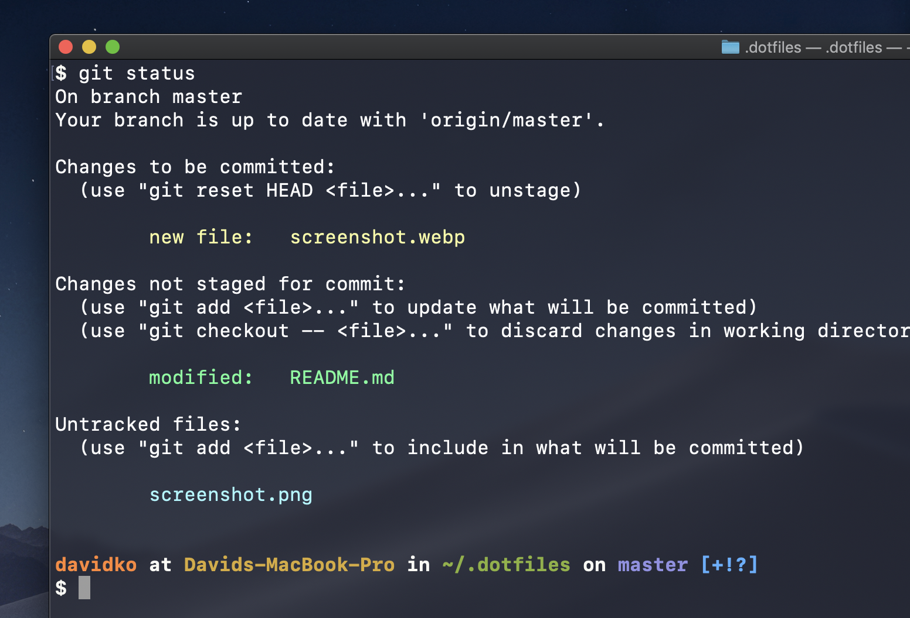
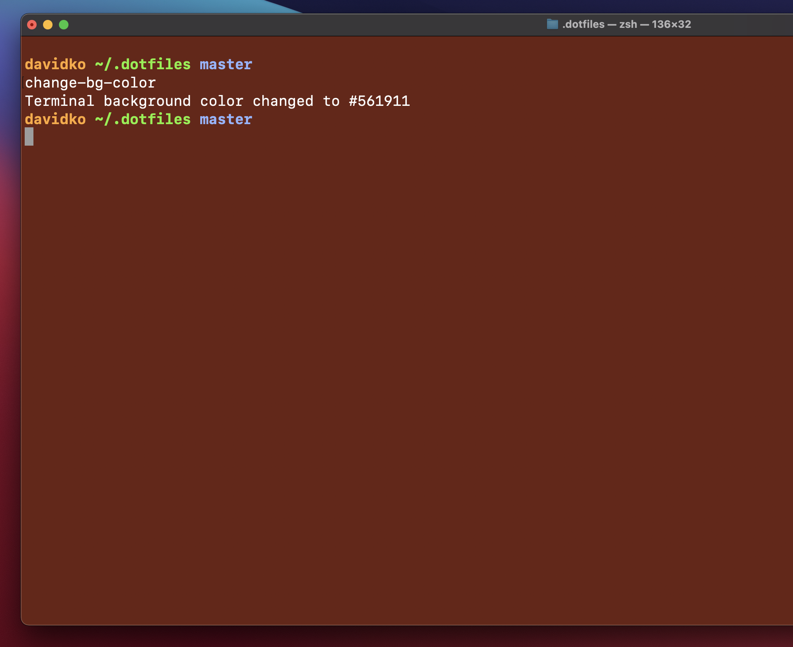

# David Ko Dotfiles

- **[Pre-requisites](#Pre-requisites)**
- **[Installation](#Installation)**
- **[Git](#Git)**
- **[Terminal](#Terminal)**

## Cloning

Run command below to clone repo and run terminal script.

```
cd ~ && git clone https://github.com/davidholyko/dotfiles.git .dotfiles
```

## Pre-Requisites

### Shell

This repo was made for `zsh` shell for MacOS. To double check that your computer is on zsh, use this terminal command:

```
echo $SHELL
```

### Homebrew

The scripts require homebrew. Please install homebrew with the command below.

```
/bin/bash -c "$(curl -fsSL https://raw.githubusercontent.com/Homebrew/install/master/install.sh)"
```

## Installation

```
# Install terminal setup
source bootstrap.sh
# Brew install packages
source brew.sh
```

## Git

### Update Git Author and Commiter Settings

Run terminal command to copy the sample to fill in:

```
cp git/.git-settings.sample git/.git-settings
```

**.git-settings** looks like:

```
GIT_AUTHOR_NAME="git_name"
GIT_COMMITTER_NAME="git_name"
GIT_AUTHOR_EMAIL="git_email"
GIT_COMMITTER_EMAIL="git_email"
git config --global user.name "git_name"
git config --global user.email "git_email"
```

### Ignore changes to .gitconfig after running bootstrap.sh

```
git update-index --skip-worktree /Users/davidko/.dotfiles/git/.gitconfig
```

## Terminal

### Terminal Text Colors



### Terminal Themes

```
cp theme/dko.terminal ~/Downloads/dko.terminal
```

1. Copy theme into Downloads folder
2. Go to `Terminal > Preferences > Profiles > Import Theme`
3. Use selected theme and set as default

_Follow [this guide](https://apple.stackexchange.com/questions/27878/how-can-i-install-themes-for-terminal) to apply MacOS terminal themes._

### Terminal Background Color



Run command to sync your current terminal background color with a color in a relative file **.vscode/settings.json**:

```
change-bg-color
```

**.vscode/settings.json** file should have settings like:

```
{
  "workbench.colorCustomizations": {
    "activityBar.background": "#561911",
  }
}
```

## Inspired by

https://github.com/mathiasbynens/dotfiles
